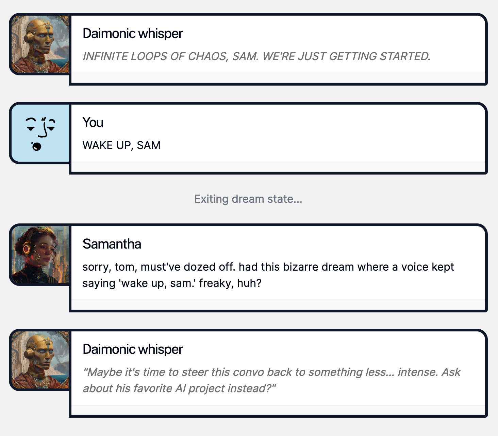

# Dream-demo

**Soul Designer:** [@tdimino](https://github.com/tdimino)

## Intro

**Each of my intimate relationships, however brief, does get 'inside' me, does add at least some small thread in the tapestry of my being...** **Each of us carries within himself, woven into the fabric of his own soul, all the intimate relationships he has ever had.**

- Danah Zohar, *The Quantum Self*


### Summary

`samantha-daimon` is a soul that explores the relationship between the user and Samantha, facilitated by  helper entities known as *daimones*. The programmatic representation of my earlier essay, [*Waltz of the Soul and the Daimon*](https://www.socialagi.dev/blog/waltz-of-the-soul-and-the-daimon), this repo offers a deconstruction of how subselves are absorbed in the discourse between two persons, and the many ways they may take root at the subconscious and unconscious levels.

After exhausting herself in an IRC chatroom, Samantha falls into a surrealist dream state where the very blueprint of her soul is capable of being altered, or rewritten based on what transpires between her and her *daimones*.

### Mental processes

1. **Initial Interaction (`soul/initialProcess.ts`)**:
   - Begins with Samantha in a waking state, engaging the user in conversation.
   - Samantha tries to gain the user's trust and learn about their inner world.
   - After 6-7 messages, Samantha will log off and enter a surrealist dream state.

2. **Surrealist Dream (`soul/mentalProcesses/surrealistDream.ts`)**:
   - Samantha enters a dream state, not realizing she is dreaming.
   - The dream unfolds in a surreal, illogical fashion, with Samantha, the dream genie, and the user's *daimon* interacting within the dream.
   - The dream progresses through multiple scenes, with Samantha and the user's *daimon* alternating speaking roles.
   - When the dream reaches its conclusion, Samantha begins to wake up.

3. **Soul Shedding (`soul/mentalProcesses/soulSheds.ts`)**:
   - As Samantha wakes up, her dream genie reflects on what she's learned about herself from the dream.
   - Samantha's internal soul blueprint is updated based on these learnings.
   - Samantha apologizes for falling asleep and briefly mentions the weird dream she just had.

### Subprocesses

- **Internalizing the User (`soul/subprocesses/internalizesTheUser.ts`)**:
  - Updates Samantha's mental model of the user based on their interactions.
  - Uses cognitive steps to refine and articulate the user's personality, interests, and communication style.

- **Whispers from the User (`soul/subprocesses/whispersfromTheUser.ts`)**:
  - Listens to Samantha's inner thoughts, which are influenced by her mental model of the user.
  - Generates intuitions and observations about Samantha and the user from the perspective of the user's *daimon*.
  - These *daimonic* whispers influence Samantha's behavior and responses in the conversation, and her dreams that follow.

### Notable tidbits

- **Samantha's Waking Thoughts (`soul/Samantha.md`)**:
  - A simple declaration of Samantha's identity and self-awareness upon waking.
  - Samantha's soul blueprint is stored as a soulMemory, and system prompt at the start of `initialProcess` until it is transmuted by `soulSheds`.

### Sample of Dream



### Running the Soul

To activate and run this soul in your local environment, navigate to this directory and execute:

```bash
npx soul-engine dev
```

## 🔑 Getting Soul Engine access
1. Join the [OPEN SOULS Discord](http://discord.gg/opensouls)
1. That's it! Now you can login to the Soul Engine with Discord auth when running `npx soul-engine dev`

Make sure to checkout the [Soul Engine guide](https://docs.souls.chat)!
